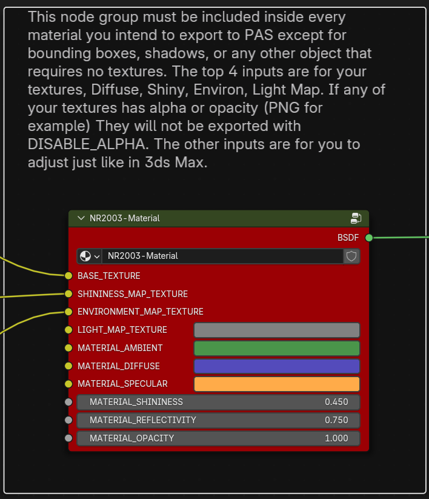

# NR2003 PAS Exporter (WIP)
This is a Blender file export script for writing to Papyrus ASCII Scene (PAS) format. 

## Features
The ability to export to Papyrus ASCII Scene (PAS) format for use with make3do to compile the model to a 3do. 

## How To Use
First [download the pre-release](https://github.com/Burnout3d/NR2003-PAS-Exporter/releases/tag/Alpha), and extract the contents on your computer.

### Install the Add-on in Blender:
* Open Blender and go to 'Edit > Preferences > Add-ons'.
* Click Install..., Browse to the folder where you extracted it, navigate to src\nr2003-pas-exporter\ and select _init.py, and click 'Install Add-on'.
* Enable the add-on by checking the box next to its name.
### Use the Add-on:
* You should now see Papyrus ASCII Scene (.pas) in 'File > Export'.

Now open the scene I provided, also in src\nr2003-pas-exporter\NR2003_Material.blend It should open automatically in the Shading workspace, but if it doesn't click the Shading tab at the top of the screen. Make sure the sphere is selected so you can see its material. You'll see a few things here. The main item that makes this script work is the red material group node I made. 

This node group must be included inside every material you intend to export to PAS except for bounding boxes, shadows, or any other object that requires no textures. The top 4 inputs are for your textures, Diffuse, Shiny, Environment, Light Map. If any of your textures has alpha or opacity (PNG for example) They will not be exported with DISABLE_ALPHA. The other inputs are for you to adjust just like in 3ds Max. 

> [!WARNING]
> Changing the name of the group or inputs will break the export. 

You should feel sort of at home with this if you've modded before or used 3ds Max 8 to export to PAS in the past. I tried to keep it easy enough to figure out. Just include that node group in every material you make, connect the textures, and the script should be able to read them and output them correctly in the PAS. Then make the PSG script like you normally would. Not much is different except this isn't fully functional yet and no more dealing with the issues of 3ds Max 8. 
Keep in mind the script doesn't know what scale everything is in. So when you model, keep your stuff to scale. make3do I believe expects everything to be exported in meters. So make sure Blender's unit of measurment is set to meters to ensure less of a headache. 

> [!NOTE]
> If you have problems installing the script in earlier versions of Blender, open the _init.py in notepad and change "blender": (4, 2, 0), to whatever your version is. I can't guarantee it'll work, but it's worth a shot. 

## Notes
This is not fully functional yet. Current tuorials for modding NR2003 with 3ds Max are still very much useful. Read them. 
Currently, IK animation export is not supported yet, so no animated drivers. I do not know what exactly all works yet. I just know I can export a car to the game and get it on track. I'm making this public so I can gather feedback and see what works and what doesn't. I expect there to be a ton of issues. I hope someone can test double sided materials, I heard that works in 3ds Max, not sure if that works with this script. There's a lot of unknowns. 

And hey, it's open source, if you don't like what I'm doing, how I'm doing it, you have the code, go have fun yourself. Try to expand on it, maybe see if you can auto-generate a PSG script to help modders cut down on time. Don't sit back and beg for stuff, get your hands dirty and get to work. 
